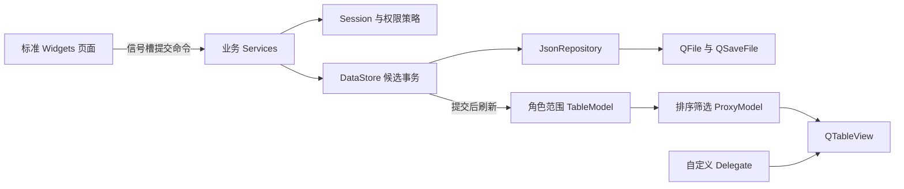

# 外卖订单管理系统 Qt C++ Coding Plan

编制日期：2026-09-04。目标：基于现有 `QTprojekt/TakeoutOrderManagementSystem` 完成可编译、可演示、可离线恢复、可按课程要求提交的桌面程序。本文是实施与验收基线，尚不代表功能已实现。

执行顺序：澄清需求与保留手写版本 → 数据实体及校验 → 原子文件存储基础 → 分阶段建立 Service 与 MVD 界面 → P0-Core 四角色闭环及 Release 验证 → P0-Hardening → 选做功能 → 打包与验收报告。先完成 Core，不能因工程强化阻塞业务主链路。

## 1 依据与项目现状

### 1.1 来源编号

| 编号 | 已读取的来源 | 对计划的约束 |
|---|---|---|
| S1 | `2026年专业技能实训I（编程训练）题目及要求.pdf`，全部 3 页并核对页面图像 | C++ 面向对象、Qt 标准控件、信号槽、Qt 文件读写、MVD、完整管理功能、Git、两版可运行项目及纯手写版 |
| S2 | `文档/2026年Qt需求分析_71125310_金俊杰_5.docx`，完整正文及 OOXML 附属内容检查 | 四角色、账户、店铺菜品、订单支付配送、账号删除、状态与输入边界 |
| S3 | `2026年 Qt程序设计报告_学号_姓名_题号.docx` | 验收报告须包含题目、功能、C++ 类关系、Qt 界面关系、文件格式、实现过程、测试、心得 |
| S4 | `语言课程设计Git提交方式学生端.pdf`，11 页文本 | 东大 GitLab、身份与仓库配置、持续提交、忽略构建产物 |
| S5 | `26暑-课程表.pdf`，1 页文本 | 用于了解课程节奏；明确交付截止日期以 S1 为准 |
| S6 | 当前工程全部业务源码、UI、CMake、两份 `.gitignore`、README；Qt Creator 配置与构建缓存 | 沿用现有目录和工具链；当前不存在可复用的外卖业务实现 |

读取范围说明：已遍历项目文件并读取当前业务文件和全部 5 份课程/需求文档；`.git` 对象库、可执行文件、对象文件等按版本/构建元数据检查，不作为业务源码逐字解释。Qt Creator 一个临时目录访问受限；`network.env` 初次目录列表中出现、后续读取时已不存在，未取得内容。S2 没有嵌入图片或文本框，未发现脚注/尾注正文；本机缺少可调用的 DOCX 渲染程序，未核验其可视分页。本文不依赖猜测的 DOCX 页码。

### 1.2 当前代码事实

| 文件/配置 | 当前状态 | 实施动作 |
|---|---|---|
| `main.cpp` | 构造 QApplication 和 MainWindow | 增加应用标识、路径解析、文件锁、数据加载、登录流程 |
| `mainwindow.h/.cpp` | 仅 `setupUi` 与释放 UI | 保留为导航容器；注入服务，禁止承载全部业务逻辑 |
| `mainwindow.ui` | 800×600 空白窗口 | 改为导航栏、页面栈、状态栏；内容区用布局管理 |
| `CMakeLists.txt` | C++17、AUTOUIC/AUTOMOC/AUTORCC、Qt5/Qt6 Widgets 模板 | 固定本机 Qt6 基线；增加库目标、Network、按需 Test |
| 仓库根 `.gitignore` | 忽略 `*.qrc` | 开发时移除此规则；`.qrc` 是资源清单源码，应提交 |
| 工程 `.gitignore` | 忽略生成文件、DLL/EXE、build、Creator 配置 | 源码仓库保留；发行 EXE/DLL 在提交压缩包单独提供 |
| `README.md` | GitLab 默认模板，标题含 `213253278` | 改写为实际项目说明、构建、数据路径、演示账号和已知限制 |
| 本机 Kit | qmake 查询为 Qt 6.11.2；配置使用 MinGW 13.1 64 位 | 使用 `C:/Qt/6.11.2/mingw_64` 和 `C:/Qt/Tools/mingw1310_64` |

已有 Git 历史出现 `Sports2026` 示例工程，检查期间出现该目录删除、外卖模板新增等工作区状态；这些状态属于现有开发现场，不在本计划生成过程中恢复、清理、提交或重置。旧运动会项目不能自动视作外卖项目的手写合格版本。已验证工具路径和版本，未执行外卖功能构建或测试。

用户指定的开发仓库为 [jjjphens-dot/qtseccion](https://github.com/jjjphens-dot/qtseccion)。本次仅将地址记录到计划，未克隆、修改 Git remote 或推送；网页读取未成功，远程内容、默认分支及写入权限尚未核实。课程材料 S1/S4 仍要求东南大学 GitLab，开发仓库与课程提交仓库的安排见第 10.1 节。

### 1.3 必须跟踪的差异与默认决策

以下“默认”是为保证可编码而补充的设计规则，不是原文已经明确的事实。D01、D02 涉及课程认定，须在对应交付前由学生核实；其他规则在需求基线中记录即可开始实现。

| ID | 原文差异/缺项 | 默认实施规则 | 核实节点 |
|---|---|---|---|
| D01 | 文件名学号 `71125310`，正文 `71125320`；README 中 `213253278` | 继续题号 5；最终文件名使用核实后的学号，仓库标识可能为一卡通号，不擅自改远程地址 | 9 月 6 日需求提交前 |
| D02 | S1 要求至少两版可编译运行，其中一版纯手写 | 学生本人独立完成并保留可运行手写版；AI 辅助实现如实记为辅助版。不能给 AI 代码改标签后称为手写 | 开始辅助代码实施前 |
| D03 | 骑手流程“完成订单”，状态表“用户确认收货后完成” | 保留原 7 状态；骑手“标记送达”仅写 `deliveredAt`，用户才能确认收货进入 Completed | 需求冻结 |
| D04 | 骑手可看制作状态，但待配送才接单 | 制作中的订单可看脱敏摘要、不能抢单；ReadyForDelivery 才允许接单 | 需求冻结 |
| D05 | 支付页与订单生成先后不统一 | 进入支付页前持久化 PendingPayment 订单；模拟支付成功才对商家、骑手可见 | 需求冻结 |
| D06 | 未要求真实支付/服务器 | 单机离线、多账号依次登录；支付与退款仅模拟状态，不接钱包、银行卡、真实资金 | README 与 UI 标注 |
| D07 | 骑手注册未写密码，其他角色有密码 | 骑手也必须账号密码；管理员不开放自助注册，首次启动单独创建初始管理员 | 认证开发 |
| D08 | 删除账号可能破坏订单引用 | 采用逻辑删除；有非终态关联订单时拒绝删除，提示先完成或合法取消；保留历史快照 | 管理模块开发 |
| D09 | 骑手收入无定价规则 | 默认每单配送费 500 分，用户支付商品金额+配送费，完成后骑手获得该配送费；订单创建时固化 | 订单模块开发 |
| D10 | 文档没有统计、修改和基础查询细节 | 补齐订单筛选、店铺/个人资料修改、菜品修改、商家销售统计、骑手收入、管理员计数，以满足 S1 | 需求冻结 |
| D11 | 未规定跨店购物、库存、退款范围 | 一单一店，不做库存；更换店铺时确认清空购物车；仅未支付用户可取消，商家待接单时可拒单并模拟退款 | 需求冻结 |

## 2 需求优先级与追踪矩阵

P0 = 最终交付不可缺失。课程把多角色列为选做，但 S2 已将四角色作为主体，所以本项目仍将其列为 P0。P1 = 完整 P0 验收通过后可增加。P2 = 本期默认不做。

| ID | 来源/优先级 | 可交付功能 | 主要实现 | 验收证据 |
|---|---|---|---|---|
| R01 | S1 P0 | C++ 面向对象、Qt 标准窗口控件、信号槽 | entities/services/models/pages | 类图、代码讲解、界面截图 |
| R02 | S1/S2 P0 | 普通用户、商家、骑手注册；四角色登录、注销与权限控制；管理员仅首次启动 bootstrap 创建，不提供自助注册 | AuthService、SessionContext、CatalogService 注册子集 | T01、T02、T14 |
| R03 | S2 P0 | 用户姓名地址维护、浏览店铺与菜品 | CustomerPage、Shop/DishModel | T03、演示录屏 |
| R04 | S1/S2 P0 | 商家建店、资料修改、菜品增删改查 | CatalogService、MerchantPage | T04、T05 |
| R05 | S2 P0 | 购物车、待支付订单、模拟支付/取消 | CartModel、OrderService | T06、T07 |
| R06 | S2 P0 | 商家接单、拒单、制作完成 | OrderService 状态机 | T08、T09 |
| R07 | S2 P0 | 骑手查看、接单、送达、收入 | RiderPage、OrderQueryService | T10、T11 |
| R08 | S2 P0 | 用户确认收货、历史订单和详情 | OrderDetailDialog | T11、T12 |
| R09 | S2 P0 | 管理员列表、查询、删除各类账号 | AdminService、AccountModel | T13、T14 |
| R10 | S1 P0 | 浏览、查找、修改、删除、统计的完整管理能力 | 过滤模型、StatisticsService | T15、T16；不要求物理删除历史订单 |
| R11 | S1 P0 | 通过 Qt 文件类读写，重启完整恢复 | JsonRepository、DataStore | T17 至 T20 |
| R12 | S1 P0 | 显式 Model/View/Delegate 分工 | QAbstractTableModel、QTableView、自定义 Delegate | T21、架构说明 |
| R13 | S1/S2 P0 | 边界校验、错误反馈、数据不变量 | Validation、各 Service、Qt Test | T01、T05、T22 |
| R14 | S1/S3/S4 P0 | 需求、两版项目、提交历史、EXE、测试数据、报告 | docs、README、发布目录 | 发布清单全部通过 |
| R15 | S2 P1 | 菜品搜索框、订单留言 | 查询条件、订单快照字段 | 核心测试不退化 |
| R16 | S2 P1 | 图片、评价、平台通知 | 后续独立模块 | 每次只选一个，补格式与权限测试 |
| R17 | S2 P2 | 投诉、促销广告、优惠计算、即时聊天 | 本期不排入关键路径 | 不放假按钮，不宣称已完成 |

基础订单/账号查询是课程管理功能；顾客端专门的菜品搜索页仍按原文选做。统计先用表格与数值标签，不为图表引入额外模块。

### 2.1 P0 内部实施顺序

R01–R17 的原优先级与最终交付范围不变，P0 内部按下列顺序执行；Hardening 仍须在最终交付前完成，不降为 P1。

| 层次 | 范围 | 阶段门禁 |
|---|---|---|
| P0-Core | 三类普通注册、管理员仅 bootstrap、四角色登录/注销与 Service 权限；店铺资料创建/修改/营业管理、菜品 CRUD；购物车、下单、模拟支付、商家接单/拒单/出餐、骑手认领/送达、用户确认、订单历史；管理员账号管理；基础查询统计；实际 MVD；JSON 原子持久化、基本 schema 与不变量校验、重启恢复；核心 Qt Test；Release 可运行 | W03–W07 按依赖完成，在 W07 末验证完整四角色纵向闭环及 Core 测试、Release；禁止让强化任务成为此门禁前置 |
| P0-Hardening | 自动 `.bak` 检测与恢复交互体验、管理员手动导出/恢复、QLockFile 第二实例处理体验与完整测试、损坏 JSON 测试扩展、写失败/commit 失败错误注入、PBKDF2 工作线程优化、恒定工作量密码比较实现细节、10,000 单性能测试与优化 | Core 门禁通过后在 W08 集中完善；全部 P0 通过后才能进入 P1 |

W03 仍必须提供原子保存、基本读写失败返回、备份/恢复底层能力和 QLockFile 最小互斥（锁失败即停止写入）。这些是数据正确性基础；复杂恢复 UI、第二实例引导和系统化故障注入推迟到 W08。时间紧张先保证 Core 完整、正确、可演示，再完成 Hardening，优先取消 P1/P2，不删除最终要求。

## 3 技术基线与代码组织

采用 C++17 + Qt 6.11.2 Widgets + CMake + Qt JSON。生产链接 Core/Gui/Widgets；密码派生使用 Qt Network 中的 `QPasswordDigestor`，链接 Network 不代表引入联网业务。Qt Test 仅在 `BUILD_TESTING=ON` 时链接。

Qt 的模型视图机制允许模型连接独立的数据源，并以 Delegate 处理显示和编辑，因此以统一 DataStore 作为 Model 层数据源，自定义表模型作为其 Qt 接口。[Qt Model/View 文档](https://doc.qt.io/qt-6/model-view-programming.html)

不增加 MySQL、Web 前端或服务器。Qt 文件类是持久化实现主体。默认只支持一个进程写同一数据目录，使用 `QLockFile`；多用户指多账号和角色切换，不承诺多机同步。

### 3.1 目标目录

以下路径以现有 `QTprojekt/TakeoutOrderManagementSystem` 为根。按阶段创建实际需要的文件，不一次性生成大量空壳。

```text
CMakeLists.txt
main.cpp
mainwindow.h/.cpp/.ui
core/
  entities.h                 # Account, Shop, Dish, OrderItem, Order, Cart
  enums.h                    # Role, OrderStatus, PaymentStatus, OrderAction
  result.h                   # Result<T>, ErrorCode
  validation.h/.cpp
  orderpolicy.h/.cpp         # 状态转换、权限、金额不变量
data/
  datastore.h/.cpp           # 私有业务集合、只读查询、事务提交
  jsonrepository.h/.cpp      # load/save/import/export、schema 校验
  apppaths.h/.cpp
services/
  sessioncontext.h/.cpp
  authservice.h/.cpp
  catalogservice.h/.cpp
  orderservice.h/.cpp
  orderqueryservice.h/.cpp
  adminservice.h/.cpp
  statisticsservice.h/.cpp
models/
  shoptablemodel.h/.cpp
  dishtablemodel.h/.cpp
  cartmodel.h/.cpp
  ordertablemodel.h/.cpp
  accounttablemodel.h/.cpp
  orderfilterproxymodel.h/.cpp
delegates/
  moneydelegate.h/.cpp
  orderstatusdelegate.h/.cpp
ui/
  logindialog.h/.cpp/.ui
  registerdialog.h/.cpp/.ui
  customerpage.h/.cpp/.ui
  merchantpage.h/.cpp/.ui
  riderpage.h/.cpp/.ui
  adminpage.h/.cpp/.ui
  disheditdialog.h/.cpp/.ui
  orderdetaildialog.h/.cpp/.ui
resources/
  resources.qrc
  style.qss
tests/
  CMakeLists.txt
  tst_validation.cpp
  tst_orderpolicy.cpp
  tst_services.cpp
  tst_persistence.cpp
  tst_models.cpp
testdata/
  demo.json
  expected_statistics.md
  invalid/                   # 坏 JSON、重复 ID、悬空引用、未知状态等
docs/
  requirements_traceability.md
  data_format.md
  test_report.md
  development_log.md
```

### 3.2 类职责和依赖

| 组件 | 负责 | 不得负责 |
|---|---|---|
| Entities/OrderPolicy | 值对象、状态规则、校验和金额计算 | QWidget、弹框、文件路径 |
| DataStore | 唯一内存快照，执行候选数据提交，通知数据变化，报告启动状态 | 用 UI 行号作业务 ID、认证或生成管理员密码 |
| JsonRepository | Qt 文件读写、格式验证、恢复与备份 | 修改订单业务状态、认证或密码处理 |
| Services | 根据 Session 查权限；调用规则；形成一次完整事务 | 直接写控件、暴露可修改容器引用 |
| TableModels | 行列映射、角色数据、编辑入口、变更信号 | 持有另一份可独立修改的业务全集 |
| Proxies | 对已授权结果进行文本/日期/状态筛选、排序 | 作为唯一权限防线 |
| Delegates | 金额显示/编辑、状态文字与颜色 | 付款、接单、跳过业务校验 |
| Pages/Dialogs | 收集输入、调用命令、展示结果与错误 | 自行改 JSON、直接设置订单状态 |



默认所有 Model/DataStore 提交在 GUI 线程执行。W04 先完成正确的密码校验与 PBKDF2；Core 通过后，W08 将耗时派生移至工作线程，完成后回 GUI 线程更新认证状态，后台代码不能修改 Model。通过 QObject 父子关系或明确的 `unique_ptr` 管理所有权，避免双重释放；实体使用值语义，不为每种角色强行建立重复继承类。

## 4 数据模型与不变量

### 4.1 实体字段

ID 使用 `QUuid::createUuid()` 产生的不含花括号字符串，持久化后不变。时间用 UTC ISO 8601 毫秒字符串，展示时转本地时间。金额用 `qint64`，单位分；禁止以浮点数累计订单金额。

| 实体 | 字段 |
|---|---|
| Account | id、loginName、displayName、role、passwordSalt、passwordHash、passwordIterations、passwordAlgorithm、defaultAddress、isDeleted、createdAt |
| Shop | id、merchantId、name、description、address、isOpen、createdAt |
| Dish | id、shopId、name、priceCents、isAvailable、isDeleted、createdAt、updatedAt |
| Cart | customerId、shopId、items[{dishId,quantity}]；一个用户最多一个活动购物车 |
| OrderItem | dishId、dishNameSnapshot、unitPriceCents、quantity、lineTotalCents |
| Order | id、customerId、shopId、riderId 可空、items、status、paymentStatus、subtotalCents、deliveryFeeCents、totalCents、riderIncomeCents、customerNameSnapshot、addressSnapshot、shopNameSnapshot、shopAddressSnapshot、riderNameSnapshot 可空、createdAt、updatedAt、paidAt/acceptedAt/readyAt/claimedAt/deliveredAt/completedAt/cancelledAt 可空、cancelReason、history |
| OrderHistoryEntry | action、fromStatus 可空、toStatus、actorId、at、reason |

订单构造时复制商品名、单价、店铺和收货信息；之后菜品涨价、改名、账号地址修改或逻辑删除不改变历史订单。`riderNameSnapshot` 在接单时复制。订单号直接使用 UUID，UI 可显示简写但查找/操作必须使用完整 ID。

关系：Account(商家) 1:1 Shop，Shop 1:N Dish，Account(用户) 1:N Order，Shop 1:N Order，Account(骑手) 1:N 已认领 Order，Order 1:N OrderItem。用户角色创建后不可在设置界面修改。

### 4.2 必须实现的校验

| 数据 | 规则与边界 | 错误反馈 |
|---|---|---|
| 登录账号 | 默认 `[A-Za-z0-9_]{3,32}`；去首尾空白，比较时转小写；全系统唯一，含已删除账号 | “账号需为3–32位字母、数字或下划线”/“账号已存在” |
| 密码 | 原文长度 8–128；默认 ASCII 可打印字符 `0x21–0x7E`，允许数字、字母、标点；不 trim，不要求额外大小写组合 | 边界 7/8/128/129；拒绝空格、控制字符和中文 |
| 用户姓名 | trim 后非空，1–40 个 Unicode 码点 | 标明最大长度 |
| 地址 | trim 后 1–200 个 Unicode 码点；用户下单、商家建店必填 | 定位到对应输入框 |
| 店铺名/菜品名 | trim、Unicode NFC 规范化；1–60 个码点；同一店中有效菜品名称按 case-fold 后唯一 | 改名同样检查，排除自身 ID |
| 简介/拒单原因 | 简介≤500；拒单原因 1–200；不接受纯空白 | 显示字段名 |
| 菜品价格 | 原文不得为负，因此允许 0；默认上限 1,000,000 分；最多两位小数 | 拒绝负数、第三位小数、非数字、超界 |
| 数量 | 每项整数 1–99；每单最多 50 种菜 | 禁止 0、负数、小数 |
| 总额 | 默认订单上限 100,000,000 分；加乘前检查范围 | 总额超限拒绝创建 |
| 新订单/付款 | 至少一项；全部来自同店；店铺营业、商家账号有效、菜品上架未删除 | 指明失效菜品，不悄悄删项下单；历史加载不要求店铺/菜品当前仍营业或上架 |
| 文件 | 默认≤100 MiB、订单≤10,000；类型/必填字段/枚举/ID/引用/金额一致性全部校验 | 报字段路径与原因，不加载部分数据 |

这些容量与长度上限除密码、非负价格、同店重名外均为本计划默认值，集中在 Validation 常量中，调整时同步测试。密码按 ASCII 字符数，其余文本按 `toUcs4().size()` 计数，避免将 QString UTF-16 单元误当字符数。所有可输入文本以纯文本显示，禁止将用户输入解释成富文本。

### 4.3 金额与统计一致性

`lineTotal = unitPriceCents × quantity`；`subtotal = sum(lineTotal)`；`total = subtotal + deliveryFee`。默认骑手收入在确认完成时结算为 `deliveryFee`，未完成时为 0。存储中记录字段用于展示/校验，加载时必须重新计算并核对，不能信任被编辑文件中的 total。

同一订单不可重复支付、重复接单或重复结算。支付零元商品订单也走支付步骤，因为配送费仍存在。商家拒单以同一次事务将订单 Cancelled、paymentStatus Refunded；不维护独立钱包余额，避免引入双账本问题。

## 5 订单状态机与权限

### 5.1 状态迁移表

统一 `OrderStatus`：PendingPayment、Cancelled、PendingAcceptance、Preparing、ReadyForDelivery、Delivering、Completed。另设 `PaymentStatus`：Unpaid、Paid、Refunded。状态值持久化为稳定英文字符串，中文仅用于界面。

| 动作 | 操作者 | 前置状态/条件 | 结果 | 必须一起写入 |
|---|---|---|---|---|
| createOrder | 当前用户 | 购物车合法；店铺营业 | PendingPayment/Unpaid | 商品/地址/费用快照、创建历史；清空该购物车 |
| pay | 订单所有者 | PendingPayment；菜品仍有效；当前价格与快照一致 | PendingAcceptance/Paid | paidAt、历史 |
| cancel | 订单所有者 | PendingPayment | Cancelled/Unpaid | cancelledAt、取消原因、历史 |
| accept | 本店商家 | PendingAcceptance/Paid | Preparing | acceptedAt、历史 |
| reject | 本店商家 | PendingAcceptance/Paid；原因非空 | Cancelled/Refunded | cancelledAt、模拟退款与原因、历史 |
| markReady | 本店商家 | Preparing | ReadyForDelivery | readyAt、历史 |
| claim | 当前骑手 | ReadyForDelivery；riderId 为空 | Delivering | riderId、riderNameSnapshot、claimedAt、history |
| markDelivered | 被分配骑手 | Delivering；deliveredAt 为空 | 仍为 Delivering | deliveredAt、历史；显示“已送达，待确认” |
| confirmReceipt | 订单所有者 | Delivering 且 deliveredAt 非空 | Completed | completedAt、收入=配送费、历史 |

支付前菜品被删除/下架、店铺关闭或价格变化：付款失败并保留待支付订单，提示取消后重新下单，禁止静默更改快照价格。已支付后按订单快照履约，后续菜品删除不影响制作配送。

除表中转换外全部返回 `InvalidTransition`。所有业务错误不改变持久化数据。重复命令返回 `AlreadyProcessed` 或 `InvalidTransition`，绝不重复收费或收入。支付页“返回”保留待支付订单；“取消订单”才进入 Cancelled。商家拒单产生模拟退款，不调用真实支付接口。

### 5.1.1 订单与支付状态合法组合

| OrderStatus | 合法 PaymentStatus |
|---|---|
| PendingPayment | Unpaid |
| Cancelled | Unpaid 或 Refunded |
| PendingAcceptance | Paid |
| Preparing | Paid |
| ReadyForDelivery | Paid |
| Delivering | Paid |
| Completed | Paid |

除以上组合外全部属于非法快照：JSON 加载返回 `CorruptData`；业务候选快照也必须通过同一校验才能提交。非法用户动作仍按接口返回 `InvalidTransition`，不得构造不合法的状态组合。保持 7 个 OrderStatus；`claimedAt` 仅表示骑手认领时间，没有独立取餐动作或取餐状态。

### 5.1.2 关键时间与历史不变量

下述“及之后”仅指正常履约路径，不包含 Cancelled。时间必须可解析，缺失采用 null；金额规则见第 4.3 节。校验统一由规则层提供，Repository 加载与 Service 提交复用。

| 字段/状态 | 确定性校验规则 |
|---|---|
| 支付 | PendingPayment 不得有 paidAt；Unpaid 不得有 paidAt；Paid 或 Refunded 必须有 paidAt。PendingAcceptance、Preparing、ReadyForDelivery、Delivering、Completed 必须为 Paid |
| 接单 | Preparing、ReadyForDelivery、Delivering、Completed 必须有 acceptedAt；其他状态不得有 acceptedAt，因为本期只能在商家接单前取消/拒单 |
| 出餐 | ReadyForDelivery、Delivering、Completed 必须有 readyAt；其他状态不得有 readyAt |
| 认领 | Delivering、Completed 必须同时有 riderId、riderNameSnapshot、claimedAt；其他状态三者均为空。riderId 非空必有 claimedAt，禁止时间或骑手信息单独存在 |
| 送达 | deliveredAt 只允许出现在已认领的 Delivering 或 Completed；Delivering 可为空，Completed 必填 |
| 完成 | Completed 必须有 deliveredAt 和 completedAt，且 completedAt >= deliveredAt；其他状态不得有 completedAt |
| 取消 | cancelledAt 当且仅当 Cancelled 必填；Completed 不得有 cancelledAt；Cancelled 不得有 completedAt。Cancelled/Unpaid 对应用户支付前取消，Cancelled/Refunded 对应商家待接单拒单 |
| 时间先后 | 正常路径已有字段按 createdAt ≤ paidAt ≤ acceptedAt ≤ readyAt ≤ claimedAt ≤ deliveredAt ≤ completedAt 排列；未支付取消满足 cancelledAt ≥ createdAt，退款取消满足 cancelledAt ≥ paidAt；允许同一毫秒 |
| 骑手收入 | Completed 必须等于 deliveryFeeCents；其余状态必须为 0，送达未确认不能计收入 |
| 历史一致性 | history 非空，首条为 createOrder（fromStatus=null、toStatus=PendingPayment、at=createdAt）；其后逐条按第 5.1 节动作与角色/归属规则重放，前后状态连续，at 非递减；只有 markDelivered 合法保持 Delivering→Delivering。每个动作对应时间字段必须等于该历史条目的 at，最终状态/支付状态/骑手/收入与重放结果一致；updatedAt 等于最后一条 at。缺关键动作、重复动作或孤立时间字段均拒绝 |

历史校验通过保存的 actorId 查对应账号的固定角色，并核对订单归属；逻辑删除的账号仍可作为历史操作者，不能因其当前已删除而否定过去合法操作。重放检查状态与历史一致性，不用当前菜品价格/上架或店铺营业状态重新否定历史付款。T18/T22 依据本表逐项构造反例，不自行推断额外状态或时间规则。

### 5.2 角色与数据范围

| 角色 | 可读数据 | 可写动作 | 禁止事项 |
|---|---|---|---|
| 普通用户 | 营业店铺、上架菜品、本人购物车与全部本人订单 | 本人资料、购物车、下单/付款/取消/确认 | 查看其他用户订单、改订单金额与状态字段 |
| 商家 | 本店商品和资料、本店已支付订单与其取消历史 | 本店菜品、店铺资料、营业状态、接单/拒单/制作完成 | 改别店商品、看别店订单、确认用户收货 |
| 骑手 | 已支付未认领订单的脱敏摘要、本人已认领订单 | 认领待配送、标记本人订单送达 | 认领制作中订单、看其他骑手完整订单、代用户确认 |
| 管理员 | 普通用户/商家/骑手基础资料、注册计数与平台汇总 | 删除符合条件的账号 | 读取密码哈希/盐、任意改订单状态、自助注册管理员 |

骑手认领前仅展示订单号、商品摘要、店铺、制作状态、配送费和目的地区域；不暴露用户完整姓名地址。认领后显示履约必需的完整信息。普通用户、商家、骑手的详情查询由服务层校验归属后返回 DTO，不能先把所有订单塞进页面再只隐藏行。

管理员的“删除账号”是逻辑删除：用户有非终态订单、商家店铺有非终态订单、骑手有配送中的订单时均拒绝；无阻塞时标记账号删除，商家同时关闭店铺并下架菜品，清除该账号活动购物车；订单与引用实体仍保留。已删除账号禁止登录，订单快照继续可读。管理员不在删除列表中，防止删除最后一个管理员。

身份只来自内部 SessionContext；UI 不得把自选角色或任意 userId 当作已授权身份。登录角色选择必须与存储角色匹配。每次修改重新校验账号未删除、实体归属与当前状态；隐藏按钮只用于体验，服务校验才是权限依据。

## 6 服务接口和事务约定

以下为接口契约草案，不是要求照抄的成品代码。所有 ID 均来自完整业务 ID；金额由服务计算。

`Result<T>` 必须支持无值操作，例如 `Result<void>` 或等价 `StatusResult`；不得强行返回无意义对象。所有失败结果包含 `ErrorCode`、`message`、可选 `field`，调用方必须检查失败。有返回实体/ID 的操作使用有值结果。

```cpp
// Result<T>: ok/value；Result<void>: ok；失败均含 ErrorCode/message/可选 field
enum class ErrorCode {
    Validation, NotFound, Forbidden, Conflict, InvalidTransition,
    AlreadyProcessed, Persistence, CorruptData, UnsupportedVersion
};

AuthService::bootstrapAdmin(const AdminBootstrapRequest&);
AuthService::registerAccount(const RegisterRequest&); // 普通用户/骑手；拒绝管理员及绕过建店的商家注册
AuthService::login(const QString& account, const QString& password, Role expectedRole);
AuthService::logout();
CatalogService::createMerchantWithShop(const MerchantRegistration&);
CatalogService::updateProfile(const ProfileChanges&);
CatalogService::updateShop(const ShopChanges&);
CatalogService::createDish(const DishDraft&);
CatalogService::updateDish(const QString& dishId, const DishChanges&);
CatalogService::deleteDish(const QString& dishId);
OrderService::updateCart(const CartChanges&);
OrderService::createOrder(const CheckoutRequest&);
OrderService::execute(const QString& orderId, OrderAction action,
                      const QString& reason = {});
OrderQueryService::visibleOrders(const OrderFilter&);
OrderQueryService::orderDetail(const QString& orderId);
AdminService::deleteAccount(const QString& accountId);
StatisticsService::summary(const DateRange&);
JsonRepository::load(const QString& path);
JsonRepository::save(const QString& path, const StoreSnapshot&);
```

已登录业务事务顺序固定为：读取当前 Session → 检查操作权限 → 校验输入及当前实体 → 克隆候选 StoreSnapshot → 修改候选并验证全局不变量 → 原子保存候选 → 成功后发布内存快照与变更信号 → UI 展示成功。未登录的注册/bootstrap 是显式 Service 入口：普通注册限制角色，bootstrap 检查合法初始空库与 NeedsAdminBootstrap；其余候选校验与落盘步骤相同，不能要求先有登录 Session 才创建首个管理员。

W04 的 `CatalogService::createMerchantWithShop` 是最小注册子集：复用 AuthService 的账号/凭据校验及 PBKDF2 能力生成未持久化凭据，由 CatalogService 在一个候选事务中创建 Merchant Account 与 Shop，检查 merchant-shop 1:1 后提交。AuthService 不创建 Shop，不先单独保存商家账号；任一环节失败全部失败。W05 扩展同一 CatalogService 的资料、店铺、营业状态与菜品 CRUD。

W05 建立同一 OrderService 的 `updateCart` 子集，校验一用户一活动车、一车一店、数量及菜品合法性后落盘；W06 才增加 createOrder 与 execute 中 pay/cancel/accept/reject/markReady/claim/markDelivered/confirmReceipt 的完整命令实现。不新增 CartService，不复制权限与事务逻辑。

保存失败时内存与原文件均保持原有效状态，界面恢复按钮并显示“操作未保存，请重试”，不能先显示付款成功再尝试保存。账户注册+建店、订单创建+购物车清空、拒单+退款、完成+收入是一个事务。

每次成功提交递增 `revision`。正在处理的 UI 命令禁用提交按钮，Service 仍检查状态以抵抗重复调用。单进程单线程数据提交避免并发抢单；两个骑手依次登录时第二位对已经认领订单的操作必然失败。退出登录清空当前页面模型和敏感详情，下个 Session 重新建立授权投影。

## 7 文件格式与恢复策略

### 7.1 数据文件

默认文件位置为 `QStandardPaths::AppDataLocation/appdata.json`，应用组织名和名称在 main.cpp 中固定。状态栏可显示数据目录。测试/演示支持显式 `--data-dir <目录>`，测试不得使用真实用户数据目录。

单个 JSON 根对象保存所有关联集合，避免分别保存 accounts/orders 导致跨文件状态不一致。示意空库结构如下；W03 识别此初始结构并报告 NeedsAdminBootstrap，W04 才通过认证层引导创建管理员。

```json
{
  "schemaVersion": 1,
  "revision": 0,
  "savedAt": "2026-09-04T08:00:00.000Z",
  "accounts": [],
  "shops": [],
  "dishes": [],
  "carts": [],
  "orders": []
}
```

UTF-8；可空字段统一 JSON null；role/status/paymentStatus 使用稳定字符串；所有金额与数量必须是有界整数，不能接受带小数数字；嵌套字段严格对应第 4 节，状态组合、关键时间与 history 按第 5.1.1–5.1.2 节校验。文件上限 100 MiB、订单上限 10,000，均引用 Validation 常量，不引入压缩、数据库或分片。`data_format.md` 必须给出完整非空示例及字段表，明确 claimedAt 表示认领时间，并包含合法状态矩阵、时间/历史规则，不能只留下上述空结构。

QFile 读取、QJsonDocument 解析；使用 QSaveFile 写入并检查字节数及 `commit()` 结果，保持 direct-write fallback 关闭。QSaveFile 在提交前写临时文件、提交时替换目标，适合防止写入失败破坏原文件。[QSaveFile 文档](https://doc.qt.io/qt-6/qsavefile.html)

### 7.2 保存、备份和启动流程

1. 启动解析数据路径并建立目录；获取该目录的 QLockFile。锁未取得时停止写入，不强行抢锁；锁占用时退出第二个实例。W03 完成最小互斥和错误返回，W08 完善第二实例提示与测试，不把锁失败一律误报为进程占用。
2. 首次运行仅在主文件和备份都不存在时初始化合法空结构，由数据层返回 NeedsAdminBootstrap；可以保存空结构，重启后加载该合法初始空库仍返回同一启动状态。W03 不创建管理员、不生成或处理密码；已有但不可读的文件是错误，不当成空库。
3. 将文件完整读入候选对象，检查语法、schemaVersion、字段类型、唯一 ID、枚举、外键、状态/支付组合、金额、时间顺序与历史记录。任一失败不发布到 Store。
4. 主文件通过校验后区分启动状态：存在有效管理员则 Ready，进入正常登录，不得再次 bootstrap；合法初始空库则 NeedsAdminBootstrap；非空业务库缺有效管理员则报错并走恢复流程，不能借此重新创建初始管理员。未知更高 schemaVersion 只提示版本不兼容，禁止自动降级或覆盖。
5. 正常保存前，将上一份已验证主文件用 QSaveFile 写为 `appdata.json.bak`；备份失败则本次事务失败。随后原子提交新主文件。新库首次保存无需备份。
6. 主文件缺失/损坏而备份有效时，数据层报告可恢复状态；W03 提供验证与恢复底层能力。W08 完善自动检测后的提示“可恢复上一保存版本，最近一次修改可能丢失”；用户选择恢复后保留损坏文件副本（若存在），再恢复备份。二者都坏则进入恢复/选择数据文件流程，禁止静默清空。自动检测不等于未经确认自动覆盖。
7. 每个业务命令成功即落盘，包括已确认的购物车变更；不只在退出时保存。界面未提交编辑内容不是业务数据，关闭编辑页时询问是否放弃。
8. W08 在已建立的管理员页面及 Service 权限边界内提供“导出备份”“从备份恢复”；恢复是整体替换，先完整校验并备份当前库，二次确认后提交，随后注销当前 Session。正常管理员恢复不接受需要重新 bootstrap 的空库；P0 不做增量合并。

W04 的 AuthService 执行真正 bootstrap：在 NeedsAdminBootstrap 且当前仍为合法初始空库时，校验管理员账号/密码、执行 PBKDF2、生成账号并通过 DataStore 原子保存。成功后启动状态变 Ready 并进入正常登录；失败保留空库并允许重试。只要已有有效管理员，入口和 Service 均拒绝再次创建；Repository/DataStore 只处理数据与启动状态，不承担密码生成或认证。RegisterDialog 可复用为受该状态控制的管理员初始化表单，不能成为普通管理员注册入口。

普通用户/骑手注册与商家建店注册仅在 Ready 状态开放，Service 同样检查该条件；不得在 bootstrap 未完成时先写入其他账号，使初始空库变成无管理员的非空库。

### 7.3 UI 编辑与业务提交边界

“业务命令成功立即持久化”描述的是 Service 层已确认的离散业务操作，而不是所有 QWidget 信号。持久化原则适用于改变业务数据的命令；登录、注销、查询等不改变业务快照的操作不为此重写 JSON。

禁止直接把 `QLineEdit::textChanged`、`QSpinBox::valueChanged`、slider 或 selection 等中间/纯 UI 信号绑定到整个 Store 的保存。推荐提交点为 Add、Remove、Apply、Save、editingFinished 后明确确认、Checkout、Pay、Cancel、Accept、Reject、Mark Ready、Claim、Mark Delivered、Confirm Receipt。

购物车数量可先暂存在编辑控件或 Model 的独立编辑缓冲，用户确认一次修改后才调用 `updateCart()`；草稿不改正式 DTO/Store，不另建业务数据源。成功落盘后更新展示，失败恢复正式值并保留可重试输入；离开页面时明确处理未提交编辑，不为每个经过的数字写完整 JSON。

### 7.4 密码存储与强化顺序

账号、菜品、订单、购物车、费用、时间线均需重启恢复；密码原文不保存。W04 完成 PBKDF2-HMAC-SHA256 与随机盐（每账号至少 16 字节），保存算法名、迭代数、盐和派生值，可从 600,000 次开始实测；不得打印密码或派生材料。W08 再完成工作线程优化与恒定工作量比较实现细节，记录本机登录耗时，不以优化阻塞 W04 的正确认证流程。[Qt QPasswordDigestor 文档](https://doc.qt.io/qt-6/qpassworddigestor.html)

离线角色权限只能约束应用中的操作，不能防止拥有系统文件权限的人篡改 JSON；本期不宣称具备服务器级安全隔离。

## 8 Qt 页面与 MVD 实施细节

### 8.1 页面清单

| 页面 | 标准控件及展示 | 核心交互 |
|---|---|---|
| LoginDialog | 角色 QComboBox、账号/密码 QLineEdit、登录/注册 QPushButton | 密码掩码；错误不透露具体密码；选择管理员时不提供普通注册 |
| RegisterDialog | 普通注册提供用户/商家/骑手；账号、密码确认、姓名；用户地址；商家店名/地址/简介 | W04 根据角色调用 AuthService 或最小 CatalogService；受 NeedsAdminBootstrap 控制时复用表单初始化管理员，完成后关闭该入口；商家与店铺一次保存 |
| MainWindow | 角色和用户名 QLabel、导航 QListWidget、QStackedWidget、注销、QStatusBar | 导航可用 QListWidget；业务列表必须使用 Model/View |
| CustomerPage | 店铺/菜品 QTableView、购物车表、数量控件、结算、我的订单、资料编辑 | 一店一车；支付页明确“模拟支付”；详情按钮按状态启用 |
| MerchantPage | 菜品表、增改删、营业开关；订单表、状态筛选、销售数值 | 只操作本店；拒单必填原因；待接单/制作中/历史分组 |
| RiderPage | 可配送池、制作状态摘要、我的配送、收入标签 | 未认领不展示完整收货信息；仅 Ready 可接；送达后等待用户确认 |
| AdminPage | 角色筛选、账号搜索、账号表、计数、删除、备份恢复 | 删除对话框显示账号及阻塞原因，不显示密码字段 |
| DishEditDialog | 名称 QLineEdit、金额输入、上架 QCheckBox、保存 | 价格转整数分并复核，同店重名检查 |
| OrderDetailDialog | 商品表、收货/店铺快照、金额、历史 QTableView、操作按钮 | 只展示服务返回的授权字段，操作后刷新详情 |

窗口布局用 QVBoxLayout/QHBoxLayout/QFormLayout/QSplitter；建议初始 1200×800、最小 960×640，可滚动；避免固定坐标布局。主窗口和复杂页面可用 Designer `.ui`，简单确认框可手写。状态颜色必须配文字，不能仅靠颜色区分。

页面表描述最终功能：W04 只完成登录/注册/bootstrap 与角色路由容器；W05 建立顾客/商家的目录和购物车基础页面；W06 增加订单页、骑手页、订单详情；W07 完成管理员管理与统计；备份恢复交互在 W08 接入。未实施功能不显示可点击的空按钮；所有编辑提交遵循第 7.3 节。

### 8.2 Model 与 Delegate 契约

每个 TableModel 实现 `rowCount/columnCount/data/headerData/flags`；`setData` 只在允许编辑时实现。定义 `IdRole = Qt::UserRole+1`、`SortRole`、`StatusRole` 等角色，DisplayRole 返回本地化文字，SortRole 返回整数金额或真实时间，避免按“￥100”文本排序。

模型只持有当前 Session 授权的行 ID/DTO 投影，敏感字段不进入无权访问的模型。Proxy 进一步过滤状态、日期和关键词；每个操作先由 `mapToSource()` 或代理透传 IdRole 取得业务 ID，再交给服务。

`MoneyDelegate`：显示两位金额；可编辑场景用标准输入控件，`setModelData()` 将已校验整数分交给 Model，Model 再调用 CatalogService；失败不改显示数据并通知页面错误。`OrderStatusDelegate`：绘制状态文字和背景标识，状态列不可编辑。至少这两者实际安装在业务 QTableView 中，不能只有未使用的 Delegate 文件。

第一版统一采用 reset 通知：事务保存成功后，各 Model 在自己的 `beginResetModel/endResetModel` 区间替换只读行投影，按业务 ID 恢复选中项；内部旧投影在 reset 前保持有效，不持有 DataStore 中元素的裸引用。先保证通知正确，再根据性能证据增加 `dataChanged` 或行插入删除，不需要预先实现复杂差量框架。

## 9 查询与统计口径

基础查询：订单号（完整或部分）、状态、日期范围；商家商品名称；管理员账号/姓名/角色。日期范围按本地日历输入，转换为 UTC 半开区间 `[开始日00:00, 结束日次日00:00)`，避免遗漏最后一天的毫秒。

| 统计 | 纳入范围 | 金额/时间口径 |
|---|---|---|
| 商家完成订单数/营业额 | 本店 Completed | 按 completedAt；金额 sum(subtotalCents)，不含配送费 |
| 骑手完成单数/收入 | riderId=当前骑手、Completed | 按 completedAt；sum(riderIncomeCents)，送达未确认不计 |
| 用户累计消费 | 本人 Completed | 按 completedAt；sum(totalCents) |
| 管理员账户/店铺计数 | 有效账号、有效商家对应店铺 | 即时状态；另列已删除数量，不混入有效数 |
| 平台已完成交易额 | 全部 Completed | sum(totalCents)，明确含配送费 |

待支付、取消、仅支付未完成的订单不计入完成销售额。销售统计不按界面可见行临时相加，应由同一 StatisticsService 按统一过滤参数计算。测试数据预置至少两个用户、两个商家、两个骑手，确保跨角色泄露与跨店错误可被发现。

## 10 工作包与日程

以下工时为单人有效开发时间估计，不含真实商用软件体验与上课。总计约 60–86 小时；若时间不足，首先删除 P1/P2，不能删掉持久化、权限、MVD 或验收材料。阶段的完成标准指该包明确列出的子集，不能提前要求后续模块或 Hardening 全量验收；Core 在 W07 末验收，Hardening 在 W08 完成。允许修文档与开发同步。

| 包 | 时间/工时 | 前置 | 具体任务与文件 | 完成标准 |
|---|---|---|---|---|
| W00 | 9/4–9/6，3–4h | 无 | 核实学号与 D01–D11；实际体验同类软件并记录；补需求矩阵、状态图、范围 | 9/6 前提交一致命名的需求 Word；原文选做不混成必做 |
| W01 | 9/4–9/7，6–9h | W00 核心规则 | 学生独立完成可运行手写纵向版本；Qt 工程、最小订单模型、增改删查、文件读写 | 独立构建运行并保留提交/标签、截图和手写范围说明；是否满足课程认定需核实 |
| W02 | 9/7–9/8，4–5h | W01 | entities/enums/result/validation/orderpolicy；修复 qrc 忽略、拆 CMake 库与测试目标 | 规则边界与金额/状态单测通过；程序仍可启动 |
| W03 | 9/8–9/9，5–7h | W02 | DataStore、JsonRepository、AppPaths、QLockFile 最小互斥、schema/快照校验、原子保存、备份/恢复基础、首次文件初始化判断；无认证或密码逻辑 | T17–T20 数据存储基础子集通过（见第11节）；保存失败不修改内存快照；合法初始空库返回 NeedsAdminBootstrap，不要求创建管理员 |
| W04 | 9/9–9/10，4–6h | W03 | Session/Auth、账号校验与 PBKDF2、管理员 bootstrap、登录注册 UI/路由；建立最小 CatalogService::createMerchantWithShop | 初始管理员原子保存后进入正常登录，已有有效管理员拒绝 bootstrap；三类注册、四角色登录/注销可用；商家账号+店铺 1:1 一次提交、任一失败全部失败 |
| W05 | 9/10–9/11，5–7h | W04 | 扩展 W04 的同一 CatalogService：updateProfile/updateShop/createDish/updateDish/deleteDish、营业状态；Shop/Dish/Cart Models、MoneyDelegate、顾客/商家基础页面；建立 OrderService 的 updateCart 子集，含一用户一车、一车一店、数量/菜品校验与持久化 | 菜品增改删查、资料/营业修改、购物车明确提交后可重启恢复；基础 MVD 可用；不要求订单命令或完整状态机集成 |
| W06 | 9/11–9/14，10–14h | W05 | 扩展同一 OrderService：createOrder、pay/cancel/accept/reject/markReady/claim/markDelivered/confirmReceipt；接入 OrderQueryService、OrderModel/Filter、OrderStatusDelegate、详情 UI、商家订单动作与骑手页 | 下单→付款→接单→出餐→认领→送达→确认全部落盘；拒单/取消支路通过，历史/claimedAt/支付矩阵一致；无重复 Service |
| W07 | 9/14–9/15，4–6h | W06 | AdminService、AccountModel、AdminPage、StatisticsService、查询统计；汇总核心测试、按第12节执行首次 Release 构建/部署冒烟 | 删除边界、权限、固定样例统计通过；三类注册及管理员 bootstrap、四角色闭环、基础校验/恢复/MVD/Core Qt Test 与 Release 可运行构成 Core 门禁 |
| W08 | 9/16–9/18，8–11h | W07 Core 门禁 | 完善备份恢复体验及管理员导出/恢复、第二实例处理、损坏 JSON 扩展、写失败/commit 错误注入、PBKDF2 工作线程与比较细节、10,000 单性能测试；执行完整 P0 功能回归 | T17–T22 强化子项、全部 P0 功能测试及本机 Release 回归通过；Core 不退化；9/18 冻结功能并保留第二版可运行提交；目标机器最终发行验收在 W10 |
| W09 | 9/19–9/20，3–5h | W08 | 仅有余量才做搜索/留言等一项 P1；否则修缺陷 | 不增加未完成入口；新增字段有持久化/权限测试 |
| W10 | 9/20–9/22，6–8h | W08/W09 | Release 打包、干净环境验证、README、验收 Word、截图、提交清单 | 9/22 生成候选包，全部交付门禁通过 |
| W11 | 9/23，2–4h | W10 | 最终校验命名/版本/附件并提交三类材料与仓库 | 截止前提交完成，有文件和远程提交核对记录 |

关键路径 W00→W01→W02→W03→W04→W05→W06→W07→W08→W10→W11。手写版本的具体范围是否被教师认定为一版合格项目应尽早核实；不能等到最后一天用空窗口补标签。AI 可帮助规划、解释、评审与测试设计，但被要求“纯手写”的代码必须由学生真实独立完成。

依赖核对：W02 的 OrderPolicy 是独立规则及测试，W06 才接入完整订单命令；W03 的存储测试使用合法固定快照，不需要 Auth/订单 Service；W04 的删除账号登录场景可用已删除账号 fixture，不依赖 W07 删除 UI。W04 建立最小 CatalogService，W05 原类扩展；W05 建立购物车 OrderService，W06 原类扩展；W07 的管理员页、统计和 Core Release 均在该包建立，W08 恢复 UI 才有可用管理员入口。第12节命令是可提前执行的模板，不是需要等待 W10 才存在的模块。W09 只在完整 P0 后实施，W10/W11 负责最终发行和提交，不反向阻塞 Core。

### 10.1 每个工作包的提交规则

一个可评审逻辑单元一次提交，提交前编译并执行与本次变更相关的测试。示例：`feat: 实现订单状态机与角色校验`、`fix: 保存失败时保持订单原状态`、`test: 增加跨店订单权限用例`、`docs: 记录JSON字段与恢复流程`。

手写版本验证后可标记 `v0.1-handwritten`，完整版本验证后可标记 `v1.0-complete`；名称仅建议，不能据标签推断作者身份。每个标签记录提交 hash、Kit、构建命令、运行证据。保留历史，不通过 squash、强推或重新初始化掩盖开发过程。当前仓库已存在，不重复 `git init`，不照搬 README 中的 force push 命令。

开发仓库采用用户指定的 `https://github.com/jjjphens-dot/qtseccion`，后续实施时先核对本地工作区、已有 remote 与远端历史，再配置对应远端；不假定远程为空或默认分支为 main，不因换开发仓库丢弃已有迭代记录。W00 记录仓库安排，W01 起的手写版与后续版本均须保留可追踪历史。

课程提交仍按 S1/S4 使用教师分配的东南大学 GitLab 仓库，最终在 W11 前同步课程要求的源码、两个可运行版本及其历史；GitHub 开发仓库不自动替代该项交付。如果学生希望只提交 GitHub，须由学生向教师确认是否允许替代，确认前保留 GitLab 提交要求。具体 remote 名称和同步操作在实施时确定，本次计划修改不执行远程配置或上传。

## 11 测试设计与验收用例

核心规则、存储和权限用 Qt Test 自动验证；页面布局与跨角色演示手工验证。每个用例用独立 `QTemporaryDir`，注入固定时钟/可预测 ID 生成器或断言其关系，避免依赖真实用户文件和“当前日期”。此处是待执行用例，不能在报告中预填“通过”。

测试随模块建立，不等到 W08 才编写。W03 用合法 fixture 验证 T17 的序列化/重载、T18 的基本 schema/状态时间/引用校验、T19 的可重复普通写失败返回与内存不变、T20 的空库启动状态/底层备份恢复/最小互斥；不调用尚未建立的认证与订单服务。W04–W07 逐步加入 Service/UI 集成、T21 模型协议及 T22 关键不变量反例，W07 前完成 Core 用例和 T23 的 Release 冒烟。W08 才要求 T18 扩展坏文件组合、T19 短写/commit 等系统化错误注入、T20 完整恢复与第二实例交互，以及 T21/T22 完整回归；T23 干净目标机器的最终验收在 W10 完成。这些分阶段子集不削减下表的最终测试范围。

| 用例 | 输入/操作 | 预期结果 |
|---|---|---|
| T01 注册边界 | 密码 7/8/128/129 位；特殊字符；重复账号大小写；空白名字 | 8/128 合法，7/129 非法；合法标点可用；账号规范化后不能重复；失败不写文件 |
| T02 身份与角色 | 正确密码选错角色、错密码、已删除账号、尝试普通注册管理员；合法空库 bootstrap 成功后重复调用/重启再尝试；初始化保存失败重试 | 非法登录/普通管理员注册失败；bootstrap 成功后进入四角色正常登录且不能再创建初始管理员；保存失败保留 NeedsAdminBootstrap；注销后不能沿用旧授权 |
| T03 用户隔离 | 用户甲修改地址/购物车，用户乙登录，再回甲；数量中间 valueChanged/textChanged 与明确 Apply 分别观察事务次数 | 乙看不到甲购物车/订单；甲已提交数据恢复，旧订单地址快照不变；中间编辑不保存，确认一次调用 updateCart 并持久化一次 |
| T04 菜品管理 | 同店同名、不同店同名、修改到重名、删除已被历史引用菜品 | 同店拒绝、异店允许；历史快照仍可读；下架商品不能新下单 |
| T05 输入金额 | -0.01、0、0.01、上限、上限+0.01、1.001、超长文本 | 非法精度/负数/超限拒绝；0 可用；长文本有明确反馈；无崩溃 |
| T06 结算正确性 | 12.34 元×2 + 0.01 元×3，配送费 5 元 | subtotal=2471 分，total=2971 分；混店/空车/数量0或100拒绝 |
| T07 待支付支路 | 下单后返回、重启、付款前取消；重复点击支付 | 待支付恢复；取消不可支付；成功支付只有一次历史与状态变化 |
| T08 商家操作 | 非本店接单、未付款接单、重复接单、制作完成 | 越权/非法状态失败；合法 PendingAcceptance→Preparing→Ready |
| T09 拒单退款 | 已付款待接单拒单，空原因，制作中拒单 | 仅第一种且原因非空成功；状态 Cancelled/Refunded；统计不计入 |
| T10 骑手竞争 | 制作中抢单；骑手甲认领后乙用旧 ID 再抢；乙标记甲订单送达 | 全部非法动作失败；成功认领仅一次写入 riderId/riderNameSnapshot/claimedAt/history；无重复分配 |
| T11 完成流程 | 未送达用户确认；骑手标记送达；用户确认；再次确认 | 未送达拒绝；送达仍 Delivering；确认后 Completed，收入仅计一次 |
| T12 历史稳定 | 完成后改菜价/店名/用户地址，再逻辑删除相关账号 | 历史商品、费用、地址与身份快照保持；外键可解析 |
| T13 删除约束 | 删除有待支付/制作中/配送中订单的相关账号，再测试终态账号 | 有活动关联拒绝；终态逻辑删除成功，禁登录、不损历史 |
| T14 越权调用 | 绕过按钮直接调用 Service，伪造 ID、读他人详情、尝试篡改角色 | 返回 Forbidden/NotFound；无数据与磁盘变化，无敏感 DTO |
| T15 查询排序 | 金额 2/10/100，筛选后选第二行执行操作，日期月底跨日 | 数值顺序正确；操作命中正确业务 ID；结束日完整包含 |
| T16 统计口径 | 完成单 A商品1000+配送500、B商品2000+配送500，同店同骑手；另加取消/未完成订单 | 商家3000、骑手1000、平台4000分，完成单数2；其他单不计 |
| T17 Round-trip | 保存含四角色、7状态的全部8种合法支付组合、中文标点、多明细、购物车、claimedAt 和完整合法 history 的 fixture 后重新加载 | 实体逐字段语义相等；状态矩阵与时间不变量保持；稳定 ID 与快照恢复；不要求 JSON 键顺序一致 |
| T18 文件异常 | 坏语法、空文件、缺字段、重复ID、孤立shopId、未知角色/状态/版本；枚举7×3组合；100 MiB/超限与10,000/10,001单边界 | 非法字段/状态组合返回 CorruptData，未知高版本返回 UnsupportedVersion，容量超限拒绝；边界内且合法的文件可加载；不部分恢复、不覆盖，可定位原因 |
| T19 写入失败 | 注入备份失败、短写、commit失败；模拟只读目录/目标失败 | 原内存、主文件保持有效；操作返回失败；重启仍为旧版本 |
| T20 恢复与锁 | 主文件缺失或坏/备份好、两份都坏、两份都不存在、已保存初始空库、有效管理员库、非空库缺管理员、同目录第二实例 | 首次/合法初始空库为 NeedsAdminBootstrap，W03 不创建管理员；有效管理员库 Ready；非空库缺管理员及两份都坏不能静默初始化；可恢复时按流程确认；第二实例不写入 |
| T21 Model 协议 | 对各自定义模型挂 QAbstractItemModelTester，增改删/reset；切换 Session | 模型结构有效，选中项按ID恢复；注销无旧角色数据残留 |
| T22 不变量攻击 | 按5.1.1/5.1.2逐项变异：非法支付组合、Unpaid带paidAt、Paid/Refunded缺paidAt、缺acceptedAt/readyAt、riderId与claimedAt不成对、未认领却送达、Completed缺deliveredAt/completedAt或完成早于送达、非Cancelled带cancelledAt、Cancelled带completedAt、未完成有收入/完成收入错误、缺失/断链/重复/时间不符的history；另测篡改金额、负数量 | 加载/候选快照校验拒绝；明确字段或历史条目原因；合法claim/markDelivered/confirmReceipt生成的数据通过同一校验，未完成不计收入；业务失败无内存/磁盘变化 |
| T23 端到端部署 | 解压到中文带空格路径，无 Qt Creator/无 Qt PATH，切换四角色完成一单并重启 | EXE可启动、数据可保存恢复、无缺失平台插件/MinGW DLL |

性能目标属于实施目标而非已测结果，在 W08（Core 通过后）执行：构造合法、≤100 MiB 的 10,000 单数据集，包含快照、claimedAt 等适用时间与完整 history，记录实际大小和每单明细分布；筛选交互目标≤300 ms，启动/保存目标≤2 s。文件上限与订单上限独立检查，不承诺10,000个最大明细订单必然小于100 MiB。若实测明显卡顿，记录机器与样本，优先减少重复解析与刷新，再考虑后台序列化；不能因性能优化破坏 GUI 线程模型规则与保存成功语义，也不能在 Core 完成前因此阻塞业务开发。

### 11.1 测试数据交付

`demo.json` 至少包含：2 用户、2 商家/店、2 骑手、1 管理员；每店≥3 菜品；覆盖全部 7 个订单状态、拒单退款、已送达未确认、历史快照变化等场景。所有账号和地址均用演示数据，README 单独说明演示密码。坏数据放 `testdata/invalid`，不能作为正常启动数据。

`expected_statistics.md` 列每个固定样例的金额与归属；统计应可手算核对。初次真实运行不自动导入演示账户；演示通过 `--data-dir` 指定复制后的样例目录，防止覆盖正常数据。

## 12 构建与发布执行模板

命令从当前工程目录执行。以下是实现完成后的操作模板，本次仅核实了工具路径，未运行构建。实施时 CMake 需提供 `BUILD_TESTING`，并注册 `add_test`；启用 Qt Test 的测试可执行文件由 CTest 执行。

```powershell
Set-Location 'C:\Users\JJJPh\Desktop\shcoolfile\programa\QTprojekt\TakeoutOrderManagementSystem'
$env:PATH = 'C:\Qt\6.11.2\mingw_64\bin;C:\Qt\Tools\mingw1310_64\bin;' + $env:PATH

& 'C:\Qt\Tools\CMake_64\bin\cmake.exe' -S . -B build/plan-debug -G 'MinGW Makefiles' -DCMAKE_BUILD_TYPE=Debug -DCMAKE_PREFIX_PATH=C:/Qt/6.11.2/mingw_64 -DCMAKE_CXX_COMPILER=C:/Qt/Tools/mingw1310_64/bin/g++.exe -DCMAKE_MAKE_PROGRAM=C:/Qt/Tools/mingw1310_64/bin/mingw32-make.exe -DBUILD_TESTING=ON
& 'C:\Qt\Tools\CMake_64\bin\cmake.exe' --build build/plan-debug --parallel 4
& 'C:\Qt\Tools\CMake_64\bin\ctest.exe' --test-dir build/plan-debug --output-on-failure

& 'C:\Qt\Tools\CMake_64\bin\cmake.exe' -S . -B build/plan-release -G 'MinGW Makefiles' -DCMAKE_BUILD_TYPE=Release -DCMAKE_PREFIX_PATH=C:/Qt/6.11.2/mingw_64 -DCMAKE_CXX_COMPILER=C:/Qt/Tools/mingw1310_64/bin/g++.exe -DCMAKE_MAKE_PROGRAM=C:/Qt/Tools/mingw1310_64/bin/mingw32-make.exe -DBUILD_TESTING=OFF
& 'C:\Qt\Tools\CMake_64\bin\cmake.exe' --build build/plan-release --parallel 4

# 用新的发行目录，每次避免混入旧DLL；每步检查退出码，失败立即停止
New-Item -ItemType Directory -Path release-candidate/app -Force
Copy-Item -LiteralPath build/plan-release/TakeoutOrderManagementSystem.exe -Destination release-candidate/app/
& 'C:\Qt\6.11.2\mingw_64\bin\windeployqt.exe' --release --compiler-runtime --dir release-candidate/app release-candidate/app/TakeoutOrderManagementSystem.exe
```

CMake 的核心设计：`takeout_core` 包含实体/存储/服务，`takeout_models` 包含表模型，主程序链接模型与 Widgets；测试直接链接核心和模型，不启动整个主窗口。只承诺经过验证的 Qt6 工具链，不保留未经测试的 Qt5 兼容声明。

Windows 部署需 EXE 之外的 Qt 运行库、平台插件与编译器运行库；使用匹配 Kit 的 windeployqt，并在无开发环境的机器上验收。[Qt Windows 部署文档](https://doc.qt.io/qt-6/windows-deployment.html)

压缩包建议目录：

```text
<核实学号>_金俊杰_5/
  source/                 # 完整CMake、.h/.cpp/.ui/.qrc及资源，不带build或.git
  app/                    # Release EXE、Qt/MinGW运行库、platforms/qwindows.dll
  testdata/               # 演示有效数据和坏数据测试样例
  README.md               # 启动、构建、数据目录、账号、模拟支付、版本信息
  test_report.md
```

必要运行库是运行附件；不要把 `.obj`、CMakeCache、自动生成的 moc/ui 头、Creator 本地设置和其他构建中间产物放入包中。`release-candidate/` 应在开发时加入忽略，发行附件与源码仓库分开管理。

## 13 交付门禁与验收材料

### 13.1 课程交付

| 交付物 | 文件名规则 | 截止时间 | 内容核对 |
|---|---|---|---|
| 需求 Word | `2026年Qt需求分析_<核实学号>_金俊杰_5.docx` | 2026-09-06 | 正文/文件名学号一致；真实调研；角色/流程/数据/校验/优先级 |
| 项目压缩包 | `<核实学号>_金俊杰_5.zip` | 2026-09-23 | 完整源码、可运行EXE、运行依赖、测试数据；无中间文件 |
| 验收 Word | `2026年Qt程序设计验收报告_<核实学号>_金俊杰_5.docx` | 2026-09-23 | 按 S3 模板，结果与实际程序一致 |
| GitLab 源码 | 教师分配的课程仓库；开发仓库为 GitHub `jjjphens-dot/qtseccion` | 2026-09-23 | 至少两版可编译运行，含真实手写版，完整迭代记录；未经教师确认不以 GitHub 替代 |

S1 指定共享目录根为 `D:\ShareCache (2)\曹玲玲(103009310)\03 实验岗工作\2026 语言课程设计\学生提交\`，对应子目录为“需求分析文档”“源码测试数据及可执行文件”“验收报告”。这些是材料中的目标路径，本次未验证机器可达性或执行提交。

### 13.2 验收报告填充地图

| 模板章节 | 应放内容与证据 |
|---|---|
| 题目/功能描述 | 第5题“外卖订单管理系统”、完成范围和未选功能，不虚构扩展 |
| C++ 设计 | Account/Shop/Dish/Order 关系、服务职责、Result 错误处理、状态策略 |
| Qt 设计 | 页面关系、实际 Model/View/Delegate 类和信号槽路径，截图对应实际功能 |
| 文件格式描述 | schemaVersion、全部字段类型、金额单位、ID引用、快照、读写/恢复算法、真实样例 |
| 实现过程 | 按提交记录说明搭建顺序、实际遇到的问题及解决，不编造开发经历 |
| 测试报告 | T01–T23 的执行环境、输入、预期、实际、通过/失败、截图或日志、缺陷修复记录 |
| 心得建议 | 学生自己的理解与课程反馈；标明实际 AI 辅助范围与手写版范围 |

### 13.3 Definition of Done

- [ ] 普通用户/商家/骑手自助注册、管理员仅首次 bootstrap；已有管理员禁止再次初始化；四角色登录/注销及一单完成、拒单支路全部可操作，无假按钮。
- [ ] 菜品增改删查、账号管理、订单筛选与统计满足 R01–R14。
- [ ] 用户/商家/骑手跨账号越权测试失败且不泄露详情；服务层有权限检查。
- [ ] 所有成功的数据变更命令均已持久化；UI 中间编辑不触发保存；重启恢复快照、购物车、费用、时间线；写失败不显示成功。
- [ ] 7 状态及送达标记有唯一规则，重复操作不重复收费、分配和结算。
- [ ] TableModel/Proxy/Delegate 在实际界面使用，模型协议测试无错误。
- [ ] 数据无悬空引用，账号/菜品删除不破坏历史，统计可与固定数据手算一致。
- [ ] Debug 测试与 Release 构建通过；在无 Qt 环境机器运行并验证中文路径。
- [ ] P0-Core 门禁先通过；P0-Hardening 的恢复交互、第二实例处理、故障注入、密码实现强化及性能测试全部完成，未被降为选做。
- [ ] 手写版与完整版都能独立构建运行，并有真实提交、运行证据和作者范围说明。
- [ ] 需求 Word、报告 Word、压缩包、GitLab 名称和版本一致，按 S1 截止时间提交。

## 14 开始编码时的第一批动作

1. 保留现有工作区状态，核对 Git diff；确认正在删除的 Sports2026 是否属于用户意图，不恢复、不混入外卖提交。
2. 核实 D01 身份信息，落实 D02 手写版本；在 9/6 前把默认业务规则补进需求文档。
3. 完成并验收学生本人手写版后，从该基线演进；修正 `.qrc` 忽略规则、建立测试入口和代码分层。
4. W02–W03 先实现实体、独立订单规则、JSON 事务与启动状态，运行基础规则/存储测试；不提前要求管理员创建、系统化故障注入或恢复 UI。
5. W04 完成 bootstrap/Auth 与最小商家建店 Service；W05 扩展 CatalogService 并建立同一 OrderService 的购物车子集；W06 再接完整订单命令及商家/骑手/用户闭环；W07 补齐管理员、统计与 Core Release 验证。
6. 每完成一个工作包更新追踪和测试证据；Core 通过后在 W08 完成 Hardening，全部 P0 通过后才考虑 P1，不提前投入聊天、广告、优惠或复杂视觉装饰。

计划完成的判断依据是可验证的业务行为和交付证据，不是文件数量、界面数量或提交数量。
